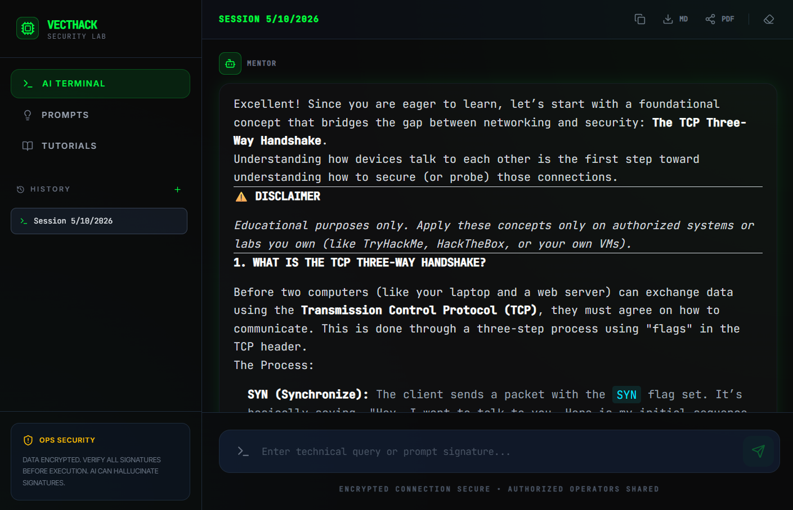
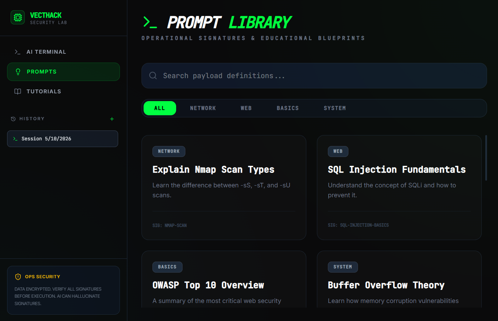
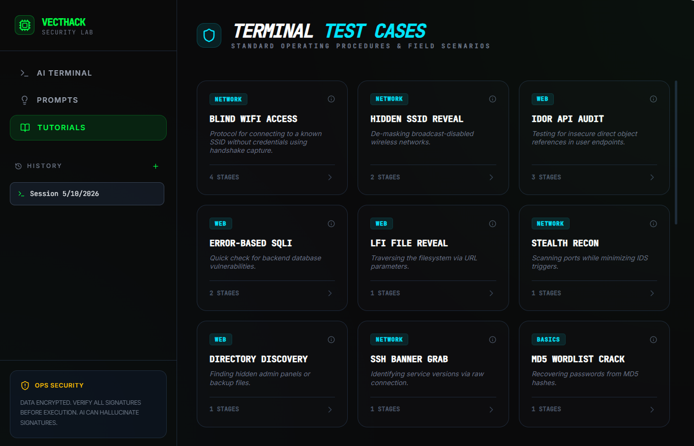

# VecthackBox 🛡️💻

VecthackBox is an **AI-powered cybersecurity sandbox** and mentorship platform designed to bridge the gap between theoretical networking and advanced security exploitation. Powered by Google's Gemini AI, it provides a high-fidelity environment for researchers and students to explore offensive and defensive security concepts through interactive dialogue and curated technical blueprints.

## 🚀 Key Features

*   **🤖 Gemini AI Mentor:** Real-time, intelligent guidance for complex cybersecurity queries, from exploit analysis to remediation strategies.
*   **📚 Operational Prompt Library:** A curated database of "Payload Signatures"—pre-configured prompts for Nmap, SQL Injection, OWASP Top 10, and more.
*   **🧪 Interactive Test Cases:** Step-by-step technical tutorials covering WiFi exploitation, API auditing (IDOR), privilege escalation, and network reconnaissance.
*   **⚡ Cyber-Terminal UI:** A high-performance, terminal-inspired interface built with React and Framer Motion, featuring professional aesthetics and micro-animations.
*   **🔐 Session Management:** Local persistence for research sessions, allowing you to track and manage multiple cybersecurity investigations.

## 📸 Interface Preview



<div style="display: grid; grid-template-columns: repeat(2, 1fr); gap: 10px;">


</div>

## ⚖️ Disclaimer

This repository is for **educational and ethical hacking purposes only**. All techniques should be performed in a controlled environment with explicit permission. The developer assumes no liability for misuse of the tools or information provided.

## 🛠️ Getting Started

### Prerequisites
*   [Node.js](https://nodejs.org/) (Latest LTS recommended)
*   A Google Gemini API Key

### Installation

1. **Clone the repository:**
   ```bash
   git clone https://github.com/kwasihenri/vecthackbox.git
   cd vecthackbox
   ```

2. **Install dependencies:**
   ```bash
   npm install
   ```

3. **Configure Environment:**
   Create a `.env` file (or rename `.env.example`) and add your Gemini API key:
   ```env
   VITE_GEMINI_API_KEY=your_api_key_here
   ```

4. **Launch Development Server:**
   ```bash
   npm run dev
   ```
   Access the sandbox at `http://localhost:3000`.

---

Developed by [Kwasi Henri](https://github.com/kwasihenri) | [View on GitHub](https://github.com/kwasihenri/vecthackbox)

